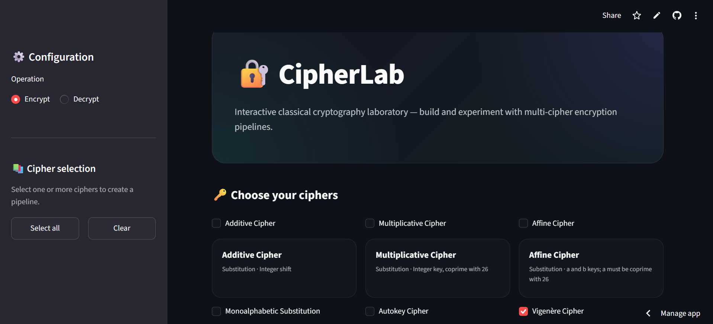

# CipherTool 🔐

### Classical Cryptography — Reimagined as an Interactive Web App

CipherTool is a Python-based cryptography application that lets users **encrypt and decrypt messages using 10 classical cipher techniques** through an interactive Streamlit interface.

🌐 **[https://amna-ciphertool.streamlit.app/]**



## 🔐 Ciphers Implemented

1. **Additive Cipher**
2. **Multiplicative Cipher**
3. **Affine Cipher**
4. **Monoalphabetic Substitution Cipher**
5. **Autokey Cipher**
6. **Vigenère Cipher**
7. **Playfair Cipher**
8. **Keyless Transposition Cipher**
9. **Keyed Transposition Cipher**
10. **Double Transposition Cipher**

## ✨ Features

* 🔒 **Encryption & Decryption** — Encrypt plaintext or decrypt ciphertext using the selected cipher.
* 🔟 **10 Classical Ciphers** — Explore substitution, transposition, and polyalphabetic techniques.
* 🎛️ **Interactive Interface** — Select a cipher, operation, and required key directly from the web interface.
* 📋 **Instant Results** — View encrypted or decrypted output directly in the application.
* 🐍 **Pure Python** — Core cipher implementations built using Python without external cryptography libraries.

## 🛠️ Tech Stack

* **Python**
* **Streamlit**
* **Git/GitHub**

## 🔄 How It Works

```text
Select Cipher
      ↓
Choose Encrypt / Decrypt
      ↓
Enter Message & Key
      ↓
Cipher Processing
      ↓
Encrypted / Decrypted Result
```

## 🚀 Run Locally

### Clone the repository

```bash
git clone https://github.com/aamnamz/ciphertool.git
cd ciphertool
```

### Install dependencies

```bash
pip install -r requirements.txt
```

### Run the application

```bash
streamlit run app.py
```

The application will open in your browser.

## 📌 Project Status

**Deployed and available as an interactive Streamlit web application.**

## 👩‍💻 Author

**Amna Mumtaz**

[GitHub](https://github.com/aamnamz) · [LinkedIn](https://www.linkedin.com/in/amnaamumtaz/)
